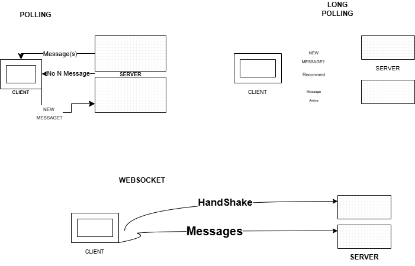

# Communication method for Mobile App and Chat Servers

- Initially we have 3 possibiliites: 
1. Polling 
2. Long Polling 
3. WEBSOCKET

# Most Communication Apps use Websockets. So do we! Why? 

🦥 Polling 
- Sequence of Actions here looks like: 
Do you have new messages? CLIENT -> Server 
Server -> CLIENT; No messages 

Again

Do you have new messages? CLIENT -> Server 
Server -> CLIENT; Here are new messages. 

Problem: Wastes Bandwidth and adds latency. Latency and Network are the enemy!
We will burn a lot of resource for no reason. 

🥱 Long Polling 
- Sequence of Actions here looks like: 
Wait for new messages or timeout 
Requests for new messages, 
if new message available, push to UI 
else will timeout means no message delivered to UI. 

Still problematic because we are constantly opening new connection, which is high cost. While we can open connection once and keep-connection alive, wastes resource due to many connection requests and increased Round Trip Time due to handshake. 

😀 Websocket 
- Sequence of Actions here looks like: 
One Bi-directional persistent connection between Chat Server and Mobile App. 
Client and Server can push message at anytime.
Trade-offs here, require special load balancers, need to user layer for load balancing, require more memory in server side. 
